<div align="center">


[LinkedIn](https://linkedin.com/in/purnagya-raj) &nbsp;·&nbsp;
[GitHub](https://github.com/Purnagya08) &nbsp;·&nbsp;
[LeetCode](https://leetcode.com/Purnagya08) &nbsp;·&nbsp;
[HackerRank](https://www.hackerrank.com/Purnagya08) &nbsp;·&nbsp;
[email](mailto:purnagya.raj26nov@gmail.com)

</div>


> Computer Science undergraduate at UEM Jaipur · CGPA: 8.795/10<br>
> Full Stack · AI/ML · Backend Engineering · Microservices

I build practical software systems across the full stack, with a focus on
backend engineering, AI/ML integration, distributed systems, and
production-oriented applications.

Currently focused on Java, Python, full-stack development, data structures
and algorithms, FastAPI, PostgreSQL, and event-driven architectures.


<samp>

Languages
java · python · c · javascript · typescript

Frontend
react · next.js · tailwind · vite

Backend & Databases
node.js · express · fastapi · postgresql · mongodb · mysql · sqlite · redis · prisma

AI / ML & DevOps
pytorch · scikit-learn · docker · git · github

</samp>


**[SentinelAI](https://github.com/Purnagya08/sentinel-ai)** &nbsp;·&nbsp;
<samp>fastapi · redis streams · pytorch · scikit-learn · react · docker</samp><br>

Event-driven cyber defense simulator for real-time threat propagation,
classification, autonomous defense execution, and SOC monitoring.

6-service microservices architecture with Redis Streams, ML-based threat
classification, isolated security domains, autonomous IP blocking,
traffic rerouting, and service isolation.

**[HackFlow AI](https://github.com/Purnagya08/ACEHACK-PROJECT)** &nbsp;·&nbsp;
<samp>next.js · node.js · postgresql · prisma · fastapi · openai · jwt</samp><br>

Hackathon management platform handling registrations, team formation,
submissions, judging, and AI-powered repository analysis.

Includes organizer, judge, and participant dashboards with JWT-based RBAC,
GitHub repository classification, submission analysis, evaluation workflows,
and leaderboard management.

**[AI-Assisted Financial Advisory Engine](https://github.com/Purnagya08/AI-Assisted-financial-advisory-engine)** &nbsp;·&nbsp;
<samp>react · node.js · express · fastapi · chart.js · openai</samp><br>

AI-powered credit risk and financial advisory platform that processes
financial inputs and produces structured risk classifications and
plain-language loan eligibility explanations.

Includes real-time financial scenario simulation, multiple risk tiers,
REST APIs, financial visualizations, and AI-generated advisory reports.


<div align="center">




</div>


This profile is generated from files stored directly in this repository.

The portrait is generated locally using
`scripts/make_portrait.py`.

The contribution statistics, language statistics, yearly activity graphics,
and section headings are generated automatically by GitHub Actions.

The generated SVG graphics are committed directly to this repository rather
than relying on external statistics-image services.

The statistics workflow runs automatically and updates the generated
graphics when GitHub activity changes.

The portrait uses an animated SVG character reveal, while the statistics
graphics are generated from GitHub activity data.


### Experience

**Student Developer — ICCASA 2026**

Built conference schedule and speaker-listing pages for the ICCASA 2026
international conference, deployed for 300+ registered attendees.

**Open Source Contributor — ECWoC'26**

Contributed across 3 real-world repositories, merged 10 pull requests,
shipped features, fixed authentication issues, and resolved UI bugs.


### Achievements

- International Hackathon Finalist — LaserHacks 2025, Lasell University, USA
- 2× National Hackathon Finalist
- 2× Inter-College Hackathon Winner
- 3× Semester Rank Holder among 250+ CSE students
- NPTEL Programming in Java — 100% score
- NPTEL Java Course Topper — Top 1% nationally
- Campus Ambassador — E-Cell IIT Bombay
- 10 merged PRs during ECWoC'26


<div align="center">

[LeetCode](https://leetcode.com/Purnagya08) &nbsp;·&nbsp;
[HackerRank](https://www.hackerrank.com/Purnagya08) &nbsp;·&nbsp;
[GeeksforGeeks](https://auth.geeksforgeeks.org/user/Purnagya08) &nbsp;·&nbsp;
[CodeChef](https://www.codechef.com/users/purnagya08)

</div>


```yaml
learning:
  - System design and distributed systems
  - Advanced PostgreSQL
  - Kubernetes and container orchestration

building:
  - AI-powered full-stack applications
  - Event-driven microservices
  - Production-grade REST APIs
  - JWT-based role-based access control

exploring:
  - Next.js App Router
  - React Server Components
  - PyTorch optimization
  - Docker and CI/CD

open_to:
  - Backend engineering internships
  - Full-stack engineering internships
  - AI/ML integration roles
  - Open source collaboration
```

<div align="center">

[LinkedIn](https://linkedin.com/in/purnagya-raj) &nbsp;·&nbsp;
[GitHub](https://github.com/Purnagya08) &nbsp;·&nbsp;
[Email](mailto:purnagya.raj26nov@gmail.com)

</div>